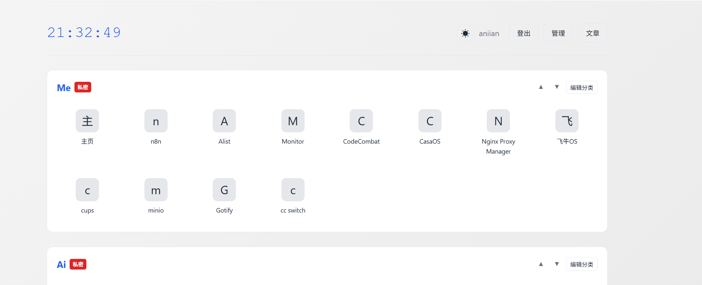
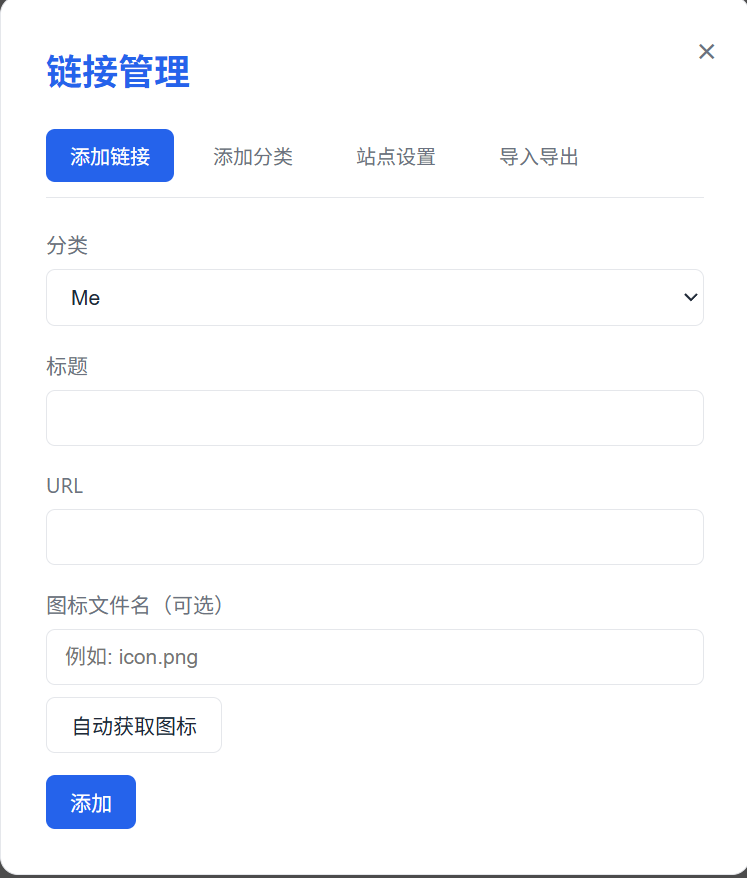
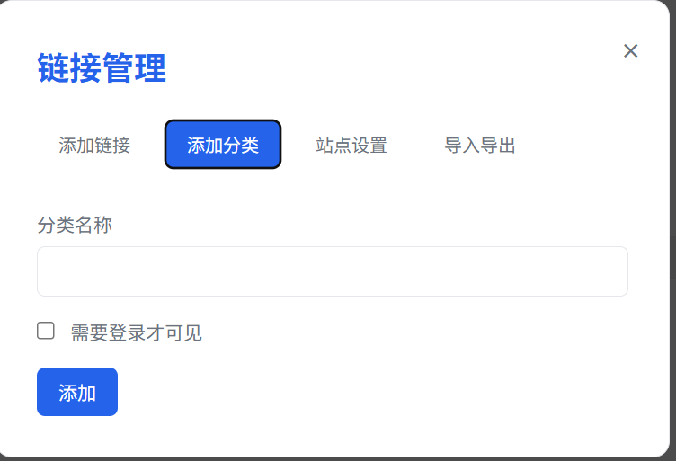
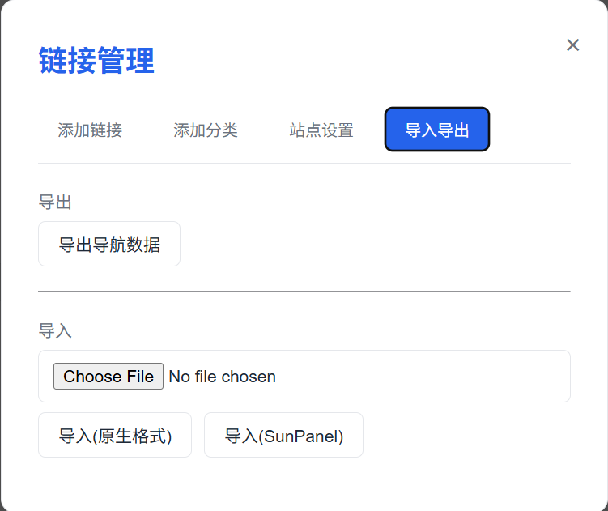
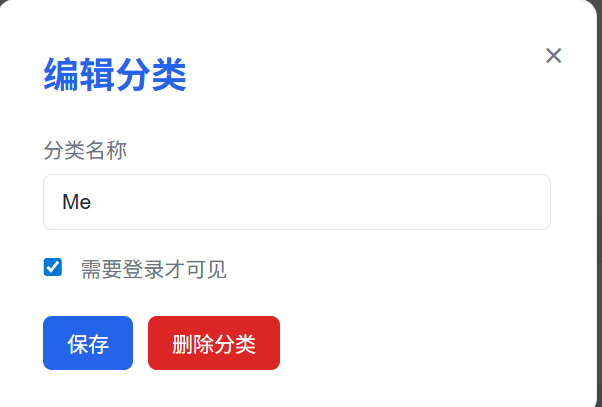
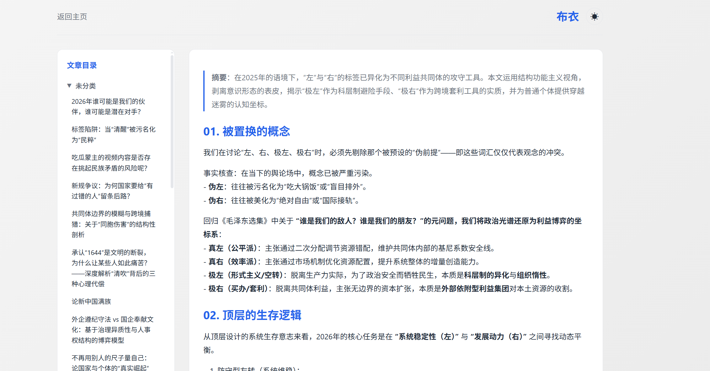

# 个人主页及导航 [demo](https://navsystem-navsystem.up.railway.app/)


一个基于 Markdown 的个人主页系统，集成导航站和文章展示功能。
## 功能特性

> **安全提示：** 本项目不再提供默认账号密码，部署时必须通过环境变量配置。详见 [安全配置](#安全配置) 章节。

### 导航站
- 分类展示常用链接（Me、Ai、APP 等分组）
- 支持图标和名称显示
- 通过 JSON 文件配置导航数据
- 实时时钟显示
- **权限控制**：部分分组需登录后才可见
- **自动获取图标**：从网站自动下载 favicon
- **链接大小设置**：支持小/中/大三种尺寸

### 文章展示
- 支持 Markdown 文章在线展示
- 目录结构浏览（可折叠，支持滚动）
- Markdown 渲染预览
- **页面标题可自定义**（登录后可修改）
- **目录权限控制**：可设置特定目录需登录后才能查看

### 文章同步（Obsidian 集成）
- **Obsidian 插件**：支持从 Obsidian 直接推送笔记
- **批量同步脚本**：Python 脚本批量上传文章
- **增量同步**：只同步更改的文件
- **Frontmatter 支持**：自动解析文章元数据和标签

### 站点设置
- **网站标题**：可自定义浏览器标签页标题
- **文章页标题**：可自定义文章页面标题
- **链接大小**：可调整导航链接的显示大小
- **受保护目录**：设置需要登录才能查看的文章目录
- **备案信息**：可配置 ICP 备案号和版权信息
- **API Token**：可直接复制 JWT Token 用于同步工具

### 主题切换
- 支持深色/浅色主题切换
- 主题偏好自动保存

### 登录功能
- **记住用户名**：勾选后下次登录自动填充用户名
- **保持登录状态**：勾选后关闭浏览器仍保持登录
- **暴力破解防护**：5 次失败后锁定 15 分钟

### 数据管理
- 前端界面添加/修改/删除导航链接
- 前端界面添加/编辑/删除分类
- **链接分类移动**：编辑链接时可更改所属分类
- 站点设置可编辑（登录后）
- 响应式设计，适配不同设备
- **管理面板**：左右分栏布局，左侧导航右侧内容可滚动

### 文章管理
- **在线编辑**：登录后可直接编辑文章内容
- **文章删除**：支持删除文章
- **目录管理**：创建、重命名、删除文章目录

### 访问与更新记录
- **访问记录**：记录用户访问的 IP、路径、时间（最多保留 1000 条）
- **更新记录**：记录链接、分类、文章、目录的增删改操作（最多保留 500 条）
- 支持查看和清空记录


## 展示
 
 
 
 
 
 



# 部署指南
<video width="100%" controls>
  <source src="./static/readme/20251212_144646.mp4" type="video/mp4">
  您的浏览器不支持 Video 标签。
</video>


本项目托管在 Railway 平台，支持一键部署：
[](https://railway.com/deploy/MxkRwo?referralCode=TEG7-_&utm_medium=integration&utm_source=template&utm_campaign=generic)


## 技术栈

- **前端**：HTML + CSS + JavaScript
- **后端**：Python FastAPI
- **数据存储**：JSON / Markdown 文件
- **认证**：JWT Token

## 项目结构

```
Homepage/
├── README.md
├── main.py                  # FastAPI 后端入口
├── static/                  # 静态资源
│   ├── css/
│   │   └── style.css
│   ├── js/
│   │   └── main.js
│   └── icons/               # 导航图标
├── templates/               # HTML 模板
│   ├── index.html           # 导航主页
│   └── article.html         # 文章展示页
├── data/
│   ├── links.json           # 导航链接配置
│   ├── settings.json        # 站点设置
│   ├── visit_log.json       # 访问记录
│   └── update_log.json      # 更新记录
├── articles/                # Markdown 文章目录
│   ├── tech/
│   └── notes/
├── obsidian-plugin/         # Obsidian 同步插件
│   ├── manifest.json
│   └── main.js
└── scripts/
    └── sync_articles.py     # 批量同步脚本
```

## 数据格式

### 导航链接 (links.json)

```json
{
  "categories": [
    {
      "name": "Me",
      "auth_required": true,
      "links": [
        {
          "title": "主页",
          "url": "https://example.com",
          "icon": "home.png"
        }
      ]
    },
    {
      "name": "Ai",
      "auth_required": false,
      "links": [
        {
          "title": "Deepseek",
          "url": "https://deepseek.com",
          "icon": "deepseek.png"
        }
      ]
    }
  ]
}
```

> `auth_required`: 设为 `true` 时，该分组仅登录用户可见

### 站点设置 (settings.json)

```json
{
  "icp": "京ICP备XXXXXXXX号",
  "copyright": "© 2024 Your Name",
  "article_page_title": "文章",
  "site_title": "个人主页导航",
  "link_size": "medium",
  "protected_article_paths": ["notes", "private"]
}
```

| 字段 | 说明 |
|------|------|
| `link_size` | 链接大小：`small`、`medium`、`large` |
| `protected_article_paths` | 需要登录才能查看的文章目录列表 |

## 安全配置

部署前**必须**设置以下环境变量，否则服务将拒绝启动：

### 环境变量

| 变量名 | 说明 | 示例 |
|--------|------|------|
| `SECRET_KEY` | JWT 密钥，至少 32 字符 | `openssl rand -hex 32` |
| `ADMIN_USERNAME` | 管理员用户名 | `myadmin` |
| `ADMIN_PASSWORD_HASH` | 密码的 bcrypt 哈希值 | `$2b$12$...` |

### 生成密码哈希

```bash
python -c "from passlib.context import CryptContext; print(CryptContext(schemes=['bcrypt']).hash('your-password'))"
```

## Docker 部署

### 拉取镜像

```bash
docker pull aniian/nav-system
```

### 运行容器

```bash
docker run -d \
  --name homepage \
  -p 8100:8000 \
  --env-file .env \
  -v $(pwd)/data:/app/data \
  -v $(pwd)/articles:/app/articles \
  -v $(pwd)/static/icons:/app/static/icons \
  --restart unless-stopped \
  aniian/nav-system:latest
```

### 环境变量配置

创建 `.env` 文件：

```env
SECRET_KEY=a1b2c3d40f6g7h8i9j001l2m3n0o5p6q7r8s0t0u1v2w3x0y5z6 
ADMIN_USERNAME=admin
ADMIN_PASSWORD=admin123
```

> **注意**：docker版本的SECRET_KEY可以不用管，会再启动后自己设置，修改用户名和密码就可以了

## 本地开发

1. 创建并激活 conda 环境：
```bash
conda create -n homepage python=3.9
conda activate homepage
```

2. 安装依赖：
```bash
pip install -r requirements.txt -i https://pypi.tuna.tsinghua.edu.cn/simple
```

3. 配置环境变量：
```bash
export SECRET_KEY=$(openssl rand -hex 32)
export ADMIN_USERNAME="admin"
export ADMIN_PASSWORD_HASH=$(python -c "from passlib.context import CryptContext; print(CryptContext(schemes=['bcrypt']).hash('your-dev-password'))")
```

4. 启动服务：
```bash
uvicorn main:app --host 0.0.0.0 --port 8100
python -m uvicorn main:app --host 0.0.0.0 --port 8100
```

5. 访问 `http://localhost:8100`

## API 接口

### 认证接口

| 方法 | 路径 | 说明 |
|------|------|------|
| POST | `/api/auth/login` | 用户登录，返回 JWT Token |
| POST | `/api/auth/logout` | 用户登出 |
| GET | `/api/auth/me` | 获取当前用户信息 |

### 导航接口

| 方法 | 路径 | 说明 | 认证 |
|------|------|------|------|
| GET | `/` | 导航主页 | 否 |
| GET | `/api/links` | 获取导航链接（根据登录状态过滤） | 否 |
| POST | `/api/links` | 添加导航链接 | 是 |
| PUT | `/api/links/{id}` | 修改导航链接 | 是 |
| DELETE | `/api/links/{id}` | 删除导航链接 | 是 |

### 分类接口

| 方法 | 路径 | 说明 | 认证 |
|------|------|------|------|
| POST | `/api/categories` | 添加分类 | 是 |
| PUT | `/api/categories/{name}` | 修改分类 | 是 |
| DELETE | `/api/categories/{name}` | 删除分类 | 是 |

### 站点设置接口

| 方法 | 路径 | 说明 | 认证 |
|------|------|------|------|
| GET | `/api/settings` | 获取站点设置 | 否 |
| PUT | `/api/settings` | 更新站点设置 | 是 |

### 文章接口

| 方法 | 路径 | 说明 | 认证 |
|------|------|------|------|
| GET | `/articles` | 文章列表页 | 否 |
| GET | `/api/articles` | 获取文章列表（根据登录状态过滤受保护目录） | 否 |
| GET | `/api/articles/{path}` | 获取文章内容 | 否* |
| POST | `/api/articles/sync` | 同步文章（从 Obsidian 等工具推送） | 是 |
| PUT | `/api/articles/{path}` | 编辑文章内容 | 是 |
| DELETE | `/api/articles/{path}` | 删除文章 | 是 |

> *受保护目录下的文章需要登录才能访问

### 目录管理接口

| 方法 | 路径 | 说明 | 认证 |
|------|------|------|------|
| GET | `/api/folders` | 获取文章目录列表 | 是 |
| POST | `/api/folders?name={name}` | 创建文章目录 | 是 |
| PUT | `/api/folders/{name}` | 重命名文章目录 | 是 |
| DELETE | `/api/folders/{name}` | 删除文章目录（含所有文章） | 是 |

### 访问与更新记录接口

| 方法 | 路径 | 说明 | 认证 |
|------|------|------|------|
| GET | `/api/visits?limit=100` | 获取访问记录 | 是 |
| DELETE | `/api/visits` | 清空访问记录 | 是 |
| GET | `/api/updates?limit=100` | 获取更新记录 | 是 |
| DELETE | `/api/updates` | 清空更新记录 | 是 |

### 图标接口

| 方法 | 路径 | 说明 | 认证 |
|------|------|------|------|
| POST | `/api/fetch-favicon` | 从网站获取图标 | 是 |

## Obsidian 插件使用

### 安装

1. 将 `obsidian-plugin` 目录下的文件复制到 Obsidian vault 的 `.obsidian/plugins/nav-system-sync/`下
2. 在 Obsidian 设置 → 第三方插件中启用 "Nav System Sync"
3. 在插件设置中配置：
   - **API 地址**：Nav System 后端地址（如 `https://your-domain.com`）
   - **JWT Token**：从管理界面 → 导入导出 → API Token 复制

### 使用方法

- **上传单个文件**：右键 `.md` 文件 → "上传到 Nav System"
- **上传文件夹**：右键文件夹 → "上传文件夹到 Nav System"
- **命令面板**：`Ctrl/Cmd + P` → 搜索 "Nav System"

## 批量同步脚本

### 安装依赖

```bash
pip install requests PyYAML
```

### 使用方法

```bash
# 基本用法
python scripts/sync_articles.py \
  --vault /path/to/obsidian/vault \
  --api https://your-domain.com \
  --token YOUR_JWT_TOKEN

# 强制同步所有文件
python scripts/sync_articles.py --vault /path/to/vault --token TOKEN --force

# 测试连接
python scripts/sync_articles.py --vault /path/to/vault --token TOKEN --test

# 指定目标路径前缀
python scripts/sync_articles.py --vault /path/to/vault --token TOKEN --target notes
```

### 参数说明

| 参数 | 说明 |
|------|------|
| `--vault, -v` | Obsidian vault 路径（必需） |
| `--api, -a` | API 地址（默认从 `NAV_API_URL` 环境变量读取） |
| `--token, -t` | JWT Token（默认从 `NAV_JWT_TOKEN` 环境变量读取） |
| `--target, -d` | 目标保存路径前缀 |
| `--force, -f` | 强制同步所有文件（忽略哈希检查） |
| `--test` | 仅测试连接 |

## 部署建议

- 使用 Nginx 反向代理并启用 HTTPS
- 定期备份 `data/`、`articles/`、`static/icons/` 目录
